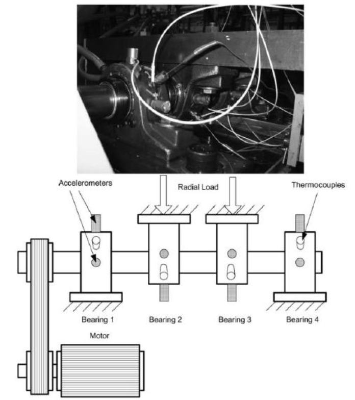
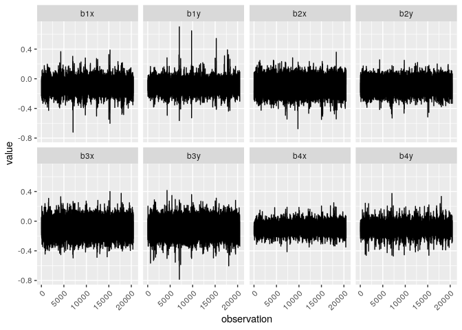
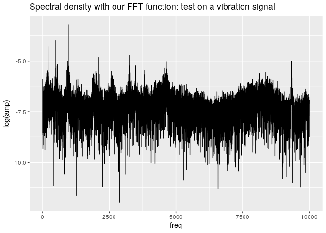
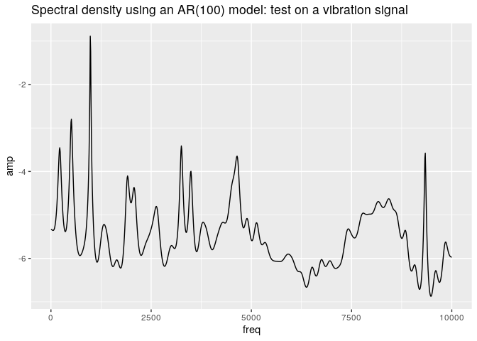
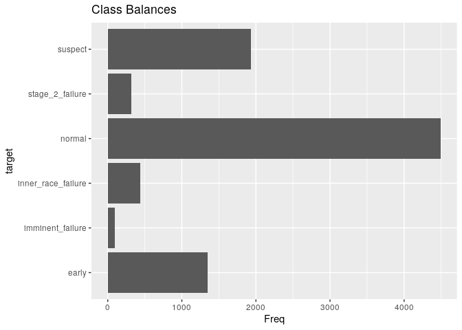
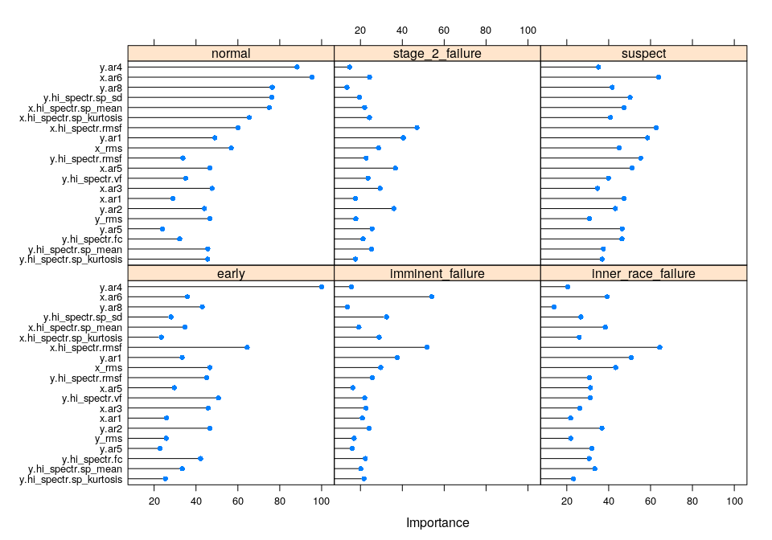
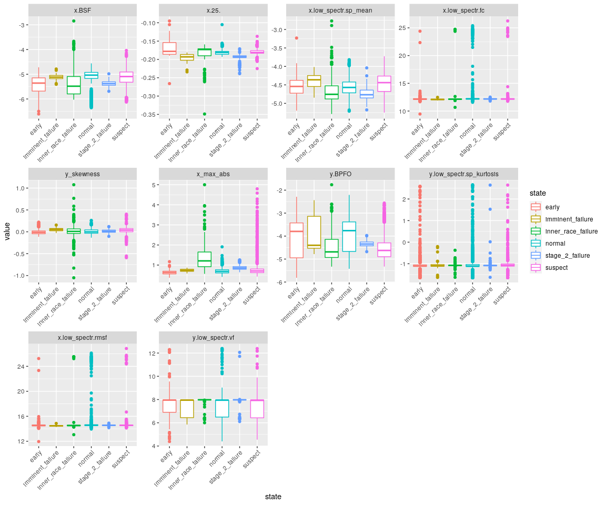
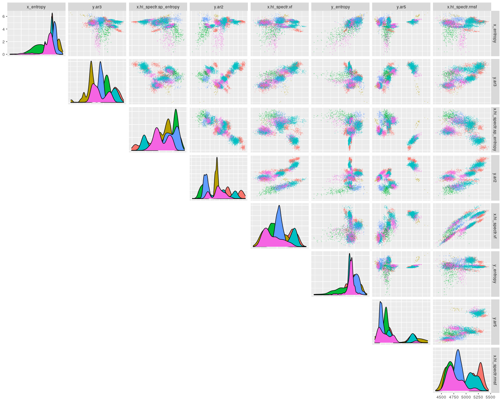

# Extracting Failure Modes from Vibration Signals
##Introduction
============

The data we’ll be using for this project comes from the Prognostics Data
Repository hosted by
[NASA](https://ti.arc.nasa.gov/tech/dash/groups/pcoe/prognostic-data-repository/),
and was made available by the Center of Intelligent Maintenance Systems
(IMS), of University of Cincinnati. The reference paper is listed below:

Hai Qiu, Jay Lee, Jing Lin. “Wavelet Filter-based Weak Signature
Detection Method and its Application on Roller Bearing Prognostics.”
Journal of Sound and Vibration 289 (2006) 1066-1090.

The data was gathered from a run-to-failure experiment involving four
bearings on a loaded shaft (6000 lbs), rotating at a constant speed of
2000 rpm, and consists of three different datasets: In set one, 2 high
precision accelerometes have been installed on each bearing, whereas in
datasets two and three, only one accelerometer has been used. Each
dataset is formatted in individual files, each containing a 1-second
vibration signal snapshot, recorded at specific intervals. Each file
consists of 20,480 points with a sampling rate set of 20 kHz. The file
name indicates when the data was collected. Each record (row) in the
data file is a data point. Here, we’ll be focusing on dataset one -
since it involves two signals, it will provide richer information. The
experiment setup can be seen below.



Previous work done on this dataset indicates that seven different states
of health are observed:

-   Early (initial run-in of the bearings)
-   Normal
-   Suspect (the health seems to be deteriorating)
-   Imminent failure (for bearings 1 and 2, which didn’t actually fail,
    but were severely worn out)
-   Inner race failure (bearing 3)
-   Rolling element failure (bearing 4)
-   Stage 2 failure (bearing 4)

For the first test (the one we are working on), the following labels
have been proposed per file:

-   Bearing 1
    -   early: 2003.10.22.12.06.24 - 2013.1023.09.14.13
    -   suspect: 2013.1023.09.24.13 - 2003.11.08.12.11.44 (bearing 1 was
        in suspicious health from the beginning, but showed some
        self-healing effects)
    -   normal: 2003.11.08.12.21.44 - 2003.11.19.21.06.07
    -   suspect: 2003.11.19.21.16.07 - 2003.11.24.20.47.32
    -   imminent failure: 2003.11.24.20.57.32 - 2003.11.25.23.39.56
-   Bearing 2
    -   early: 2003.10.22.12.06.24 - 2003.11.01.21.41.44
    -   normal: 2003.11.01.21.51.44 - 2003.11.24.01.01.24
    -   suspect: 2003.11.24.01.11.24 - 2003.11.25.10.47.32
    -   imminent failure: 2003.11.25.10.57.32 - 2003.11.25.23.39.56
-   Bearing 3
    -   early: 2003.10.22.12.06.24 - 2003.11.01.21.41.44
    -   normal: 2003.11.01.21.51.44 - 2003.11.22.09.16.56
    -   suspect: 2003.11.22.09.26.56 - 2003.11.25.10.47.32
    -   Inner race failure: 2003.11.25.10.57.32 - 2003.11.25.23.39.56
-   Bearing 4
    -   early: 2003.10.22.12.06.24 - 2003.10.29.21.39.46
    -   normal: 2003.10.29.21.49.46 - 2003.11.15.05.08.46
    -   suspect: 2003.11.15.05.18.46 - 2003.11.18.19.12.30
    -   Rolling element failure: 2003.11.19.09.06.09 -
        2003.11.22.17.36.56
    -   Stage 2 failure: 2003.11.22.17.46.56 - 2003.11.25.23.39.56

As you understand, our purpose here is to make a classifier that imitates
the expert’s opinion about the bearings’ health state. Let’s proceed:

Exploratory Analysis
====================

Before we even begin the analysis, note that there is one problem in the
description: The dimensions indicate a dataframe of 20480 rows (just as
the description of the dataset states). But, at a sampling rate of 20
kHz, a 1-second vibration snapshot should contain 20000 rows of data.
This means that each file probably contains 1.024 seconds worth of
measurements, which is probably rounded up to one second in the
description.

Let’s load the required libraries and have a look at the data:

``` r
# All required libraries for the project
library(e1071)
library(ggplot2)
library(dplyr)
```

    ## 
    ## Attaching package: 'dplyr'

    ## The following objects are masked from 'package:stats':
    ## 
    ##     filter, lag

    ## The following objects are masked from 'package:base':
    ## 
    ##     intersect, setdiff, setequal, union

``` r
library(caret)
```

    ## Loading required package: lattice

``` r
library(GGally)
```

    ## Registered S3 method overwritten by 'GGally':
    ##   method from   
    ##   +.gg   ggplot2

``` r
# Also used (but not loaded): entropy(entropy), quantMod(detectPeaks), ggcorrplot
```

``` r
files <- list.files("./1st_test")
head(files)
```

    ## [1] "2003.10.22.12.06.24" "2003.10.22.12.09.13" "2003.10.22.12.14.13"
    ## [4] "2003.10.22.12.19.13" "2003.10.22.12.24.13" "2003.10.22.12.29.13"

The filenames have the following format: yyyy.MM.dd.hr.mm.ss. Let’s have
a look at the first one:

``` r
file <- read.table(paste("./1st_test/", files[1], sep=""), 
                   col.names = paste("b", rep(1:4, each = 2), c("x", "y"), sep = ""),
                   sep = "\t")
head(file)
```

    ##      b1x    b1y    b2x    b2y    b3x    b3y    b4x    b4y
    ## 1 -0.022 -0.039 -0.183 -0.054 -0.105 -0.134 -0.129 -0.142
    ## 2 -0.105 -0.017 -0.164 -0.183 -0.049  0.029 -0.115 -0.122
    ## 3 -0.183 -0.098 -0.195 -0.125 -0.005 -0.007 -0.171 -0.071
    ## 4 -0.178 -0.161 -0.159 -0.178 -0.100 -0.115 -0.112 -0.078
    ## 5 -0.208 -0.129 -0.261 -0.098 -0.151 -0.205 -0.063 -0.066
    ## 6 -0.232 -0.061 -0.281 -0.125  0.046 -0.088 -0.078 -0.078

Let’s have a look at a file:

``` r
file %>%
  mutate(observation = as.numeric(rownames(.))) %>%
  reshape2::melt(id.vars = "observation") %>%
  ggplot(aes(x = observation, y = value)) + 
  geom_line() + 
  facet_wrap(variable~., ncol = 4) + 
  theme(axis.text.x = element_text(angle = 45, hjust = 1))
```



It can be seen that the mean vibraiton level is negative for all
bearings. That could be the result of sensor drift, faulty replacement,
etc… Furthermore, the y-axis vibration on bearing 1 (second figure from
the top left corner) seems to have outliers, but they do appear at
regular-ish intervals. Since they are not orders of magnitude different
than the rest of the data, I doubt they should be dropped. In any case,
we have 2,156 files of this format, and examining each and every one
individually will be a painfully slow process.

Conventional Wisdom
-------------------

Working with the raw vibration signals is not the best approach we can
take. After all, we are looking for a slow, accumulating process within
a very dynamic signal. Conventional wisdom dictates to apply signal
processing techniques in the waveforms, to compress, analyze and
interpret the data and to extract useful information for further
diagnostics and prognostics purposes. Waveforms are traditionally
analyzed by extracting features in the time- and frequency- domains.
More specifically:

-   Time domain features:
    -   Statistical moments: mean, standard deviation, skewness,
        kurtosis
    -   Shannon entropy, smoothness and uniformity
    -   Root-mean-squared, absolute, and peak-to-peak value of the
        waveform
    -   Shape, crest, impulse and margin factors
    -   Autoregressive coefficients
-   Frequency domain features (through an FFT transformation):
    -   Vibration levels at characteristic frequencies of the machine
    -   Frequency center
    -   Mean square and root-mean-square frequency
    -   Variance and root-variance of frequency
    -   Spectral skewness, kurtosis, entropy
    -   Similar features in higher order spectra

when working in the frequency domain, we need to be mindful of a few
standard practices:

Methods of spectral analysis
----------------------------

To be able to read various information about a machine from a spectrum,
it is worth to know which frequencies would likely occur in such a
spectrum. The spectrum usually contains a number of discrete lines and
areas of increased noise. It is appropriate to divide the spectrum into
areas, in which the various symptoms occur:

-   Usually, the spectra evaluation process starts with the
    identification of the frequency pertinent of the rotational speed of
    the shaft - rotational frequency for which the notation 1X is used.
-   Further, the integral multiples of this rotational frequencies (2X,
    3X, …) are identified, also called *harmonics*.
-   The spectrum is usually divided into three main areas:
    -   Area below the rotational frequency, called *subsynchronous*
    -   Area from rotational frequency, up to ten times of it
    -   Area above 10X - the area of high-frequency events.

Bearing defect frequencies
--------------------------

Over the years, many formulas have been derived that can help to detect
specific defects in rolling element bearings. They are based on the
geometry of the bearing, the number of rolling elements, and the
rotational frequency of the bearing.

Four types of faults are distinguished on the rolling bearing, depending
on where the fault occurs. The so called *bearing defect frequencies*
can be calculated on the basis of bearing parameters and rotational
speed of the shaft:

-   Ball Pass Frequency Inner (BPFI)
-   Ball Pass Frequency Outer (BPFO)
-   Ball Spin Frequency (BSF)
-   Fundamental Train Frequency (FTF)

These are given by the following formulas:

$BPFI = \\frac{N}{2} \\left( 1 + \\frac{B_d}{P_d} cos(\\phi) \\right) n$

$BPFO = \\frac{N}{2} \\left( 1 - \\frac{B_d}{P_d} cos(\\phi) \\right) n = N \\times FTF$

$BSF = \\frac{P_d}{2 B_d} \\left( 1 - \\left( \\frac{B_d}{P_d} cos(\\phi) \\right) ^ 2 \\right) n$

$FTF = \\frac{1}{2} \\left( 1 - \\frac{B_d}{P_d} cos(\\phi) \\right) n$

where:

-   *n*: Shaft rotational speed \[Hz\] 2000 rpm
-   *N*: No. of rolling elements \[-\] 16
-   *B*<sub>*d*</sub>: Diameter of a rolling element \[mm\] 0.331 in
-   *P*<sub>*d*</sub>: Pitch diameter \[mm\] 2.815 in
-   *ϕ*: Contact angle \[rad\] 15.17\*pi/180

Feature Extraction
==================

Time-domain Features
--------------------

Let’s write a few wrappers to extract the above features for us,
starting with time-domain features. Note that some of the features
described earlier, such as the numerous shape factors, uniformity and so
on, are just functions of the more fundamental features, like
statistical moments and rms values. To avoid unnecessary production of
information, we will only calculate the base features. Regarding the
autoregressive coefficients, we will use an AR(8) model:

``` r
# Let's define some functions to derive the features

# Read the file 
read_file <- function(filename) 
{
  raw_vib <- read.table(paste("./1st_test/", filename, sep=""), 
                   col.names = paste("b", rep(1:4, each = 2), c("x", "y"), sep = ""),
                   sep = "\t")
  return(raw_vib)
}

# RMS value
rms <- function(x){sqrt(mean(x^2))} 

# max absolute value
max_abs <- function(x){max(abs(x))} 

# Peak-to-peak value
p2p <- function(x){abs(max(x)) + abs(min(x))} 

# Shannon entropy (cut signal to 500 bins)
entropy <- function(x){entropy::entropy(table(cut(x, 500)))} 

# Autoregressive coefficients
ar_coeffs <- function(raw_signal, ar_order) 
{
  # Get the AR coeffs for each of the 8 signals and return them in a vector
  ar_coeffs <- apply(raw_signal, 2, function(x){ar(x, aic = F, order.max = ar_order)$ar}) %>%
  as.vector(.)

  # Generate a vector of names, to append them to rest of the features later on
  ar_coeffs_names <- paste("b", rep(1:4, each = 2), c("x", "y"),".ar", rep(1:ar_order, each = ar_order), sep = "") %>%
    matrix(., ncol = ar_order)
  ar_coeffs_names <- (as.vector(t(ar_coeffs_names)))
  
  # Return a 1 by n dataframe as the result
  out <- t(data.frame(ar_coeffs, row.names = ar_coeffs_names))

return(out)
}
```

Let’s wrap the function defined above in a wrapper to extract all
time-domain features per file:

``` r
# Wrapper to get all time-domain features
time_features <- function(raw_vib_file)
{
  # Extract statistical moments and rms, abs and peak-to-peak values
  time_feats <- raw_vib_file %>% summarise_all(funs(mean,
                                                    sd,
                                                    skewness,
                                                    kurtosis,
                                                    entropy,
                                                    rms,
                                                    max_abs,
                                                    p2p)) 
  
  
  # Calculate quantiles
  quants <- apply(raw_vib_file, 2, quantile)[2:4, ] # Drop the 0% and 100% quantiles
  col.names <- paste(rep(colnames(quants), each = 3), rep(rownames(quants, 8)), sep = ".")
  quants <-quants %>% as.vector %>% data.frame %>% t
  colnames(quants) <- col.names
  
  # Extract AR model coeffs and bind all the features of the vibration signal together
  time_feats <- cbind(time_feats, quants, ar_coeffs(raw_vib_file, ar_order = 8))
  
  # Remove rownames (appear due to the preprocessing done in the AR coeff function)
  rownames(time_feats) <- NULL
  
  # Return a 1 x n dataframe containing the extracted features per file
  return(time_feats)
}
```

Frequency-domain features
-------------------------

Let’s begin by creating a function to apply the Fourier transform on a
signal:

``` r
apply_FFT <- function(x, sampling_rate = 20000)
{
  # Center the signal first
  x <- x - mean(x)
  # Get the amplitudes
  amp <- fft(x)[1:(length(x) / 2)]%>% # Drop the second half - it's juast a mirror of the first half 
    Mod # Calculate the amplitude of the complex output of the previous line
  
  # Make a vector containing the frequencies
  freq <- seq(0, sampling_rate / 2, length.out = length(x) / 2)
  
  # and make a dataframe out of them (remove the dc term)
  fft_out <- data.frame("amp" = amp[-1] / length(amp), "freq" = freq[-1])

  return(fft_out)
}
```

And a quick test on a random file:

``` r
read_file(files[2000])$b2y %>%
  apply_FFT(.) %>%
  ggplot(aes(x = freq, y = log(amp))) + 
  geom_line() + 
  ggtitle("Spectral density with our FFT function: test on a vibration signal")
```



Looks about right (qualitatively), noisy but more or less as expected.
As it turns out, R has a base function to approximate the spectral
density of a stationary signal, by fitting an autoregressive model on
it. This might be helpful, as the expected result will be much less
noisy. Let’s try it out:

``` r
raw_vib <- read_file(files[2000])$b2y

raw_vib <- raw_vib - mean(raw_vib)

spec <- spec.ar(x = raw_vib, 
                n.freq = 1000, # Generate 1000 points
                order = 100, # Use an AR(100) model - might be an overkill
                plot = F) # Do not plot
spec <- data.frame("freq" = seq(0, 20000 / 2, length.out = length(spec$spec)),
                   "amp" = log(spec$spec))

ggplot(spec, aes(x = freq, y = amp)) + 
  geom_line() + 
  ggtitle("Spectral density using an AR(100) model: test on a vibration signal")
```



That’s a nice result. The peaks are clearly defined, and the result is
less noisy overall. We will be using this function for the rest of the
project. Before we move any further, we should calculate the
characteristic frequencies of the bearings. We will be keeping an eye
out on the FFT amplitude at these frequencies.

``` r
N <- 16 # No of rolling elements
n <- 2000 / 60 # Rotational speed [Hz]
Bd <- 0.331 # Rolling element diameter [in]
Pd <- 2.815 # Pitch diameter [in]
phi <- 15.17 * pi / 180 # Contact diameter [rad]

# Get the frequencies
bearing_freqs <- list("BPFI" = N / 2 * (1 + Bd / Pd * cos(phi)) * n,
                   "BPFO" = N / 2 * (1 - Bd / Pd * cos(phi)) * n,
                   "BSF" = Pd / (2 * Bd) * (1 - (Bd / Pd * cos(phi)) ^2) * n,
                   "FTF" = 0.5 * (1 - Bd / Pd * cos(phi)) * n)

bearing_freqs
```

    ## $BPFI
    ## [1] 296.9299
    ## 
    ## $BPFO
    ## [1] 236.4035
    ## 
    ## $BSF
    ## [1] 139.9167
    ## 
    ## $FTF
    ## [1] 14.77522

Now, let’s start making our wrappers to extract features in the
frequency domain, beginning with a function to give us the amplitude of
the spectral density on the characteristic bearing frequencies:

``` r
# Function to return a dataframe containing spectral density values at specific frequencies
get_spectrum <- function(signal, spectrum.points = 10000, AR.order = 100, sampling_rate = 20000)
{
  # Get spectral density
  spectrum <- spec.ar(x = signal - mean(signal), # Center the signal 
                  n.freq = spectrum.points, # Generate 1000 points
                  order = AR.order, 
                  plot = F) # Do not plot
  
  # Convert to a dataframe
  spectrum <- data.frame("freq" = seq(0, sampling_rate / 2, length.out = spectrum.points), 
                         "amp" = log(spectrum$spec))

  return(spectrum)
}

# Function to do linear interpolation on the spectral density at a given frequency
interpolate_spectrum <- function(spectrum, f0)
{
  p1 <- spectrum[max(which(spectrum$freq <= f0)), ]
  p2 <- spectrum[min(which(spectrum$freq >= f0)), ]
  out <- (p2$amp - p1$amp) / (p2$freq - p1$freq) * (f0 - p1$freq) + p1$amp
  return(out)
}

# Function to return spectraldensity values at the 
get_spectra_at_char_freqs <- function(spectrum, bearing_frequencies)
{
  # Find the log-amplitude of the spectral density at the characteristic bearing frequencies
  spec_val_char_freqs <- sapply(bearing_frequencies, interpolate_spectrum, spectrum = spectrum) %>% 
    as.data.frame %>% 
    t
  
  # Unname rows (result of the preprocessing done in the previously called function)
  rownames(spec_val_char_freqs) <- NULL
  return(spec_val_char_freqs)
}
```

Next up, let’s write a function to return the top 10 frequencies, in
terms of spectral density amplitude:

``` r
# Function to return the top n freqs (in terms of spectral content)
top_content_freqs <- function(spectrum, no_freqs)
{
  # Find the indices at which peaks occur
  peak_idx <- quantmod::findPeaks(spectrum$amp)
  
  # Isolate these instances, and get the top <no_freqs>
  peak_freqs <- spectrum[peak_idx, ] %>%
    arrange(desc(amp)) %>% 
    head(., no_freqs) %>%
    select(freq) %>%
    t
  
  return(peak_freqs)
}
```

Now, a function to return the statistical moments and some other
features from a spectrum:

``` r
# Function to calculate integral based on the trapezoidal rule
trapz <- function(x, y)
{
  # Re-center y values to zero min
  y <- y + abs(min(y))
  
  # Calculate the area using the trapezoidal method by taking the average of the "left" and "right" y-values.
  area <- sum(diff(x) * (head(y, -1) + tail(y, -1))) / 2 
  
  return(area)
}

# Function to calculate hte statistical moments of the spectrum
get_spectral_moments <- function(spectrum)
{
  f <- spectrum$freq
  s <- spectrum$amp + abs(min(spectrum$amp)) # Center to zero min
  
  fc <- trapz(x = f, y = s * f) / trapz(x = f, y = s) # Defined outside the list, as it will be used
                                                      # within the list (vf) while the latter is being created
  feats <-list("fc" = fc, # frequency center
               "rmsf" = sqrt(trapz(x = f, y = s * f * f) / trapz(x = f, y = s)), # Root mean square frequency
               "vf" = sqrt(trapz(x = f, y = (f - fc) ^ 2  * s) / trapz(x = f, y = s)), # Root variance frequency
               "sp_mean" = mean(spectrum$amp),
               "sp_sd" = sd(spectrum$amp),
               "sp_skew" = skewness(spectrum$amp),
               "sp_kurtosis" = kurtosis(spectrum$amp),
               "sp_entropy" = entropy(spectrum$amp),
               "power" = sum(exp(spectrum$amp))) # Power of the signal (sum of the FFT spectrum components)
  
  return(feats)
}
```

Next up, a function to split a spectrum into the three different
frequency areas:

``` r
# Function to split the spectrum into three different areas
split_spectrum <- function(spectrum)
{
  # Area below rotational speed of the shaft
  sub_spectrum <- spectrum %>%
  filter(freq < 2000 / 60) # Rotational speed of the shaft = 2000 rpm

  # Area between rotational speed of the shaft, up to ten times of it
  mid_spectrum <- spectrum %>%
    filter(freq >= 2000 / 60) %>%
    filter(freq < 10 * 2000 / 60)
  
  # Area above ten times the rotational speed of the shaft
  high_spectrum <- spectrum %>%
    filter(freq >= 10 * 2000 / 60)
  
  out <- list("low_spectr" = sub_spectrum,
              "mid_spectr" = mid_spectrum,
              "hi_spectr" = high_spectrum)
  
  return(out)
}
```

Wrapper for all the frequency features:

``` r
frequency_features <- function(raw_vib_file, bearing_frequencies)
{
  # Get the spectra
  spectra <- apply(raw_vib_file, 2, get_spectrum)
  
  # Calculate spectral densities at the characteristic bearing frequencies
  bear_f_spectra <- sapply(spectra, get_spectra_at_char_freqs, bearing_frequencies) %>% 
    as.vector %>% 
    t %>% 
    data.frame
  
  colnames(bear_f_spectra) <- paste(rep(colnames(raw_vib_file), each = 4), 
                                    rep(c("BPFI", "BPFO", "BSF", "FTF"), 4), sep = ".")
  
  
  no_freqs <- 15 # Return top n freqs
  top_freqs <- sapply(spectra, top_content_freqs, no_freqs = no_freqs) %>% 
    as.vector %>% 
    t %>% 
    data.frame
  
  colnames(top_freqs) <- paste(rep(colnames(raw_vib_file), each = no_freqs), 
                               "freq", rep(1:no_freqs, 4), sep = ".")
  
  # Split the spectra into three frequecy areas
  spectra <- lapply(spectra, split_spectrum)
  
  # Convert the list of lists to list
  spectra <- unlist(spectra, recursive = F)
  
  # For the entire spectrum
  moments <- sapply(spectra, get_spectral_moments) 
  col.names <- paste(rep(colnames(moments), each = 9), rep(rownames(moments), 4), sep = ".")
  moments <- moments %>% 
    do.call(cbind, .) %>% 
    as.vector %>% t %>% 
    data.frame
  colnames(moments) <- col.names
  
  # Combine all
  freq_feats <- cbind(bear_f_spectra, top_freqs, moments)
  
  # Remove rownames (appear due to the preprocessing done in the AR coeff function)
  rownames(freq_feats) <- NULL
  
  # Return a 1 x n dataframe containing the extracted features per file
  return(freq_feats)
}
```

Finally, a small wrapper to bind time- and frequency- domain features
together:

``` r
# Read a vibration file
calculate_features <- function(filename, bearing_frequencies)
{
  # Read the vibrations file
  vib_file <- read_file(filename)
  
  # Calculate the features
  feats <- cbind(time_features(vib_file), 
                 frequency_features(vib_file, bearing_frequencies))
  
  # Return them (1 by n list)
  return(feats)
}
```

We will also need to append the labels to the dataset - we do need
something to classify after all! The file numbering according to the
description was done off-line beforehand (which explains the number of
repetitions of each label):

``` r
# The filename was mapped to the file's number offline
labels <- list("b1.state" = c(rep("early", each = 151), 
                              rep("suspect", each = 449), 
                              rep("normal", each = 899), 
                              rep("suspect", each = 599), 
                              rep("imminent_failure", each = 58)),
               "b2.state" = c(rep("early", 500),
                              rep("normal", 1500), 
                              rep("suspect", 120), 
                              rep("imminent_failure", 36)),
               "b3.state" = c(rep("early", 500),
                              rep("normal", 1290), 
                              rep("suspect", 330), 
                              rep("inner_race_failure", 36)),
               "b4.state" = c(rep("early", 200),
                              rep("normal", 800), 
                              rep("suspect", 435),
                              rep("inner_race_failure", 405),
                              rep("stage_2_failure", 316))) %>%
  data.frame
```

And finally, let’s write a small function to perfrom a bit of
post-processing on the dataset, to bring it into a format suiable for
further analysis:

``` r
# Perform post processing on the column names
postprocess_dset <- function(data, bearing)
{
  # Split into individual bearing datasets
  bearing_dset <- data[, grepl(bearing, colnames(data))]
  colnames(bearing_dset) <- gsub(bearing, "", colnames(bearing_dset))
  colnames(bearing_dset) <- gsub(".state", "state", colnames(bearing_dset)) # leftovers not captured from the previous line

  return(bearing_dset)
}
```

All done! Let’s extract the features for the entire dataset, and store
them in a .csv file. Note that we do not necessairly need the filenames
themselves, as the dataset is already chronologically ordered, due to
the filename format (you can easily check this with the is.unsorted()
function).

``` r
# Function to read the vibration files, extract features, post-process the dataset, and write to an output file
extract_features <- function(input_dir, output_file)
{
  # Extract the features
  features <- lapply(list.files(input_dir), calculate_features, bearing_freqs) %>% 
    do.call("rbind", .) 
  
  # Bind them with the labels
  dset <- cbind(features, labels)
  
  # Postprocess and write to .csv
  dset <- lapply(paste("b", rep(1:4, 1), sep = ""), postprocess_dset, data = dset) %>%  
    do.call(rbind, .)
    
  
  return(write.csv(dset, file = output_file))
}

# Don't run online
# extract_features("./1st_test", "processed_data.csv")
```

Class Balance
-------------

Let’s have a look at class imbalances:

``` r
# Read in the extracted features
data <- read.csv("processed_data.csv", row.names = 1, stringsAsFactors = T)

as.data.frame(table(data$state)) %>% 
  ggplot(., aes(x = Var1, y = Freq)) + 
  geom_bar(stat = "identity") + 
  ggtitle("Class Balances") + 
  xlab("target") + coord_flip()
```



There is class imbalance, but not so extreme to justify reframing the
classification problem as an anomaly detection problem. Using F1 score
as our classifier’s objective will take care of the imbalance.

Train / Test split
==================

Let’s move on with the actual split:

``` r
# Stratified 70/30 split
train_idx <- createDataPartition(data$state, p = 0.7, list = F)
train <- data[train_idx, ]
test <- data[-train_idx, ]
```

Feature Selection
=================

Let’s first assess predictor importance. We’ll be using a model-based
approach, based on a random forest classifier. The reason for choosing a
model-based approach is that, being tied to model performance, it may be
able to incorporate the correlation structure between the predictors
into the importance calculation.

Let’s train a random forest classifier on the training set:

``` r
rf <- train(state~., 
            data = train,
            method = "rf",
            trControl = trainControl(method = "oob"),
            importance = T,
            verbose = F)
```

and get the importance of each dependent variable:

``` r
rfImp <- varImp(rf, scale = T)

plot(rfImp, top = 20)
```



We can see that each predictor has different importance for each of the
classes (reading the documentation of varImp, that is to be expected
from tree-based algorithms). It is also interesting to note that
vibration power levels at characteristic frequencies are not in the top
20 predictors. Anyway, let’s isolate the top predictors, and see how
these are correlated:

``` r
n_predictors <- 10 # Get the top ten predictors

# Extract the top predictors from the dataset
top_predictors <- data.frame("predictor" = rownames(rfImp$importance)) %>%
  mutate(pred_power = rowMeans(rfImp$importance)) %>%
  arrange(desc(pred_power)) %>%
  head(n_predictors) %>%
  select(predictor) %>%
  as.list %>%
  unlist

# And make a correlogram
train[, top_predictors] %>%
  cor(., method = "spearman") %>%
  ggcorrplot::ggcorrplot(., hc.order = TRUE, type = "lower", lab = T, show.diag = F) +
  ggtitle("Spearman Correlations")
```


Highest correlation coefficient is 0.7. We have moderately correlated
data to this point. Note that these are monotonic relations, and not
necessarily linear. Let’s make a boxplot to visualize the underlying
distributions:

``` r
train[, top_predictors] %>%
  mutate(state = train$state) %>%
  reshape2::melt(id.vars = 'state') %>%
  ggplot(aes(x = state, color = state)) + 
  geom_boxplot(aes(y = value)) + 
  facet_wrap(~variable, scales = "free") + 
  theme(axis.text.x = element_text(angle = 45, hjust = 1))
```


There are noticeable differences between groups for variables x_entropy,
y.ar3 (imminent failure), x.hi_spectr.sp_entropy, y.ar2, x.hi_spectr.vf,
y_entropy, y.ar5 and x.hi_spectr.rmsf. Let’s isolate these predictors,
and make a pair plor:

``` r
cols <- c("x_entropy", "y.ar3", "x.hi_spectr.sp_entropy", "y.ar2", "x.hi_spectr.vf", "y_entropy", "y.ar5", "x.hi_spectr.rmsf")

train %>%
  select(cols) %>%
  ggpairs(mapping = ggplot2::aes(color = train$state),
          lower = "blank",
          upper = list(continuous = wrap("points", alpha = 0.3, size=0.1), 
                       combo = wrap("dot", alpha = 0.4, size=0.2)
                       )
          )
```



Indeed, some clusters have started to emerge, but nothing easily
separable. Let’s begin modeling, and depending on the results, we might
return to more advanced feature selection methods

Predictive Modeling
===================

Let’s try stochastic gradient boosting, with a 10-fold repeated cross
validation, using Cohen’s kappa as the classification metric:

``` r
# Split into a train and a test set
trainIndex <- createDataPartition(train$state, p = .7, list = F)
train.set <- train[trainIndex, ]
test.set <- train[-trainIndex, ]
# Train control
control <- trainControl(method = "repeatedcv", number = 10, repeats = 3)

# Train the model
gbm_mdl <- train(x = train.set[, cols],
                 y = train.set$state,
                 method = "gbm",
                 verbose = F, 
                 metric = "Kappa",
                 trControl = control)
```

Let’s evaluate the perofrmance on the test set:

``` r
# Predict on the test set
predictions <- predict(gbm_mdl, test.set[, cols])

# summarize classification results
confusionMatrix(predictions, as.factor(test.set$state))
```

    ## Confusion Matrix and Statistics
    ## 
    ##                     Reference
    ## Prediction           early imminent_failure inner_race_failure normal
    ##   early                270                0                  0     13
    ##   imminent_failure       0               14                  0      0
    ##   inner_race_failure     0                0                 84      0
    ##   normal                12                0                  0    872
    ##   stage_2_failure        0                0                  1      0
    ##   suspect                1                5                  7     57
    ##                     Reference
    ## Prediction           stage_2_failure suspect
    ##   early                            0       1
    ##   imminent_failure                 0       2
    ##   inner_race_failure               1       1
    ##   normal                           0      76
    ##   stage_2_failure                 65       0
    ##   suspect                          0     326
    ## 
    ## Overall Statistics
    ##                                           
    ##                Accuracy : 0.9021          
    ##                  95% CI : (0.8875, 0.9154)
    ##     No Information Rate : 0.521           
    ##     P-Value [Acc > NIR] : < 2.2e-16       
    ##                                           
    ##                   Kappa : 0.8484          
    ##                                           
    ##  Mcnemar's Test P-Value : NA              
    ## 
    ## Statistics by Class:
    ## 
    ##                      Class: early Class: imminent_failure
    ## Sensitivity                0.9541                0.736842
    ## Specificity                0.9908                0.998882
    ## Pos Pred Value             0.9507                0.875000
    ## Neg Pred Value             0.9915                0.997210
    ## Prevalence                 0.1565                0.010509
    ## Detection Rate             0.1493                0.007743
    ## Detection Prevalence       0.1571                0.008850
    ## Balanced Accuracy          0.9724                0.867862
    ##                      Class: inner_race_failure Class: normal
    ## Sensitivity                            0.91304        0.9257
    ## Specificity                            0.99883        0.8984
    ## Pos Pred Value                         0.97674        0.9083
    ## Neg Pred Value                         0.99535        0.9175
    ## Prevalence                             0.05088        0.5210
    ## Detection Rate                         0.04646        0.4823
    ## Detection Prevalence                   0.04757        0.5310
    ## Balanced Accuracy                      0.95594        0.9120
    ##                      Class: stage_2_failure Class: suspect
    ## Sensitivity                         0.98485         0.8030
    ## Specificity                         0.99943         0.9501
    ## Pos Pred Value                      0.98485         0.8232
    ## Neg Pred Value                      0.99943         0.9433
    ## Prevalence                          0.03650         0.2246
    ## Detection Rate                      0.03595         0.1803
    ## Detection Prevalence                0.03650         0.2190
    ## Balanced Accuracy                   0.99214         0.8765

We have a Kappa value of 85%, which is quite decent. Taking a closer
look on the confusion matrix, we can see that - generally speaking -
there are small levels of confusion between early and normal data, as
well as between suspect and the different failure modes. It is also nice
to see that there is very little confusion between the classes relating
to good health and those of bad health. In addition, the failure classes
are only ever classified as different types of failures, and never as
normal behaviour. The most confusion seems to be in the suspect class,
but that is understandable, considering that the suspect class is a just
a transition from normal to a failure pattern.

These are quite satisfactory results. Of course, we could go into more
advanced modeling approaches, but the overall performance is quite good.
Let’s re-train over the entire training set, and see how we fare on the
test set:

``` r
# Train the model
gbm_mdl <- train(x = train[, cols],
                 y = train$state,
                 method = "gbm",
                 verbose = F, 
                 metric = "Kappa",
                 trControl = control)

# Predict on the prediction set
predictions <- predict(gbm_mdl, test[, cols])

# summarize classification results
confusionMatrix(predictions, as.factor(test$state))
```

    ## Confusion Matrix and Statistics
    ## 
    ##                     Reference
    ## Prediction           early imminent_failure inner_race_failure normal
    ##   early                374                0                  0     17
    ##   imminent_failure       0               19                  0      0
    ##   inner_race_failure     0                0                128      0
    ##   normal                30                2                  0   1266
    ##   stage_2_failure        0                1                  2      0
    ##   suspect                1                6                  2     63
    ##                     Reference
    ## Prediction           stage_2_failure suspect
    ##   early                            0       1
    ##   imminent_failure                 0       1
    ##   inner_race_failure               2       0
    ##   normal                           0     104
    ##   stage_2_failure                 92       0
    ##   suspect                          0     473
    ## 
    ## Overall Statistics
    ##                                          
    ##                Accuracy : 0.9102         
    ##                  95% CI : (0.8985, 0.921)
    ##     No Information Rate : 0.5209         
    ##     P-Value [Acc > NIR] : < 2.2e-16      
    ##                                          
    ##                   Kappa : 0.8602         
    ##                                          
    ##  Mcnemar's Test P-Value : NA             
    ## 
    ## Statistics by Class:
    ## 
    ##                      Class: early Class: imminent_failure
    ## Sensitivity                0.9235                0.678571
    ## Specificity                0.9917                0.999609
    ## Pos Pred Value             0.9541                0.950000
    ## Neg Pred Value             0.9859                0.996490
    ## Prevalence                 0.1567                0.010836
    ## Detection Rate             0.1447                0.007353
    ## Detection Prevalence       0.1517                0.007740
    ## Balanced Accuracy          0.9576                0.839090
    ##                      Class: inner_race_failure Class: normal
    ## Sensitivity                            0.96970        0.9406
    ## Specificity                            0.99918        0.8901
    ## Pos Pred Value                         0.98462        0.9030
    ## Neg Pred Value                         0.99837        0.9323
    ## Prevalence                             0.05108        0.5209
    ## Detection Rate                         0.04954        0.4899
    ## Detection Prevalence                   0.05031        0.5426
    ## Balanced Accuracy                      0.98444        0.9154
    ##                      Class: stage_2_failure Class: suspect
    ## Sensitivity                         0.97872         0.8169
    ## Specificity                         0.99880         0.9641
    ## Pos Pred Value                      0.96842         0.8679
    ## Neg Pred Value                      0.99920         0.9480
    ## Prevalence                          0.03638         0.2241
    ## Detection Rate                      0.03560         0.1830
    ## Detection Prevalence                0.03676         0.2109
    ## Balanced Accuracy                   0.98876         0.8905

Indeed, we get similar results on the prediction set as before. Small
confusion on the suspect class, very little to no confusion between
early and normal health states and the different failure modes.

Conclusions
===========

We have built a classifier that can determine the health status of
rolling element bearings, as well as recognize the type of fault that is
uderway. We have experimented quite a lot with feature extraction (and
reduction), which led us to choose 8 features from the two vibration
signals (x- and y- axis). We’ve managed to get a 90% accuracy on the
prediction set, but the errors are to be expected: There are small
levels of confusion between early and normal data, as well as between
“suspect” and the different “failure” modes. It is also nice to see that
there is very little confusion between the classes relating to good
health and those of bad health. In addition, the failure classes are
only ever classified as different types of failures, and never as normal
behaviour. The most confusion seems to be in the suspect class, but that
is understandable, considering that the suspect class is a just a
transition from normal to a failure pattern.
